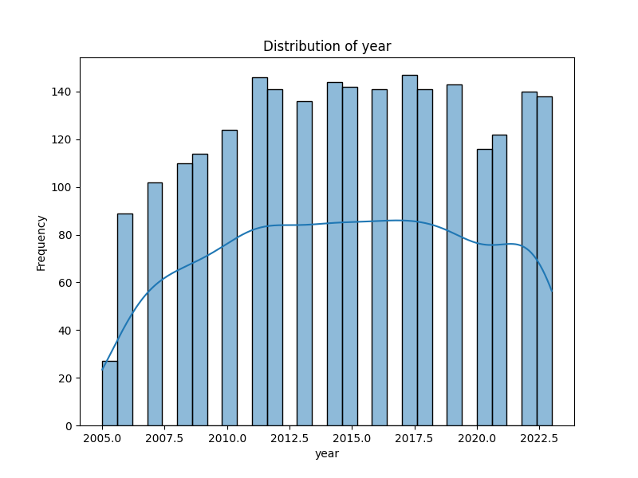
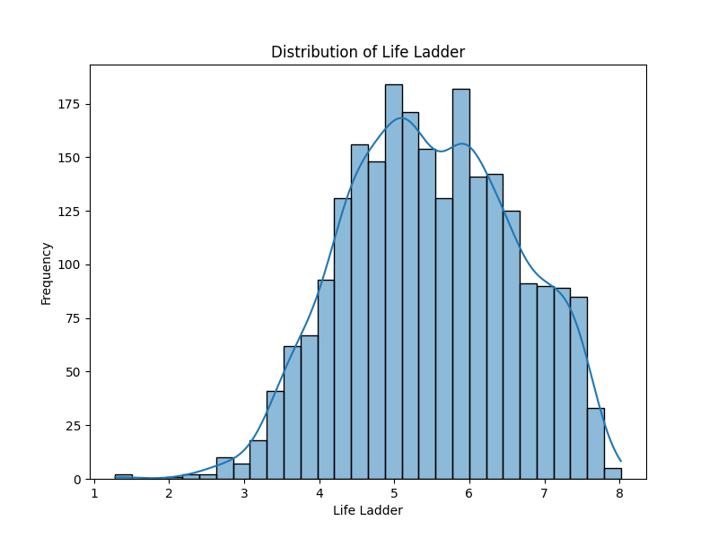

# Automated Data Analysis
## Dataset Overview
- Shape: 2363 rows and 11 columns
- Columns: Country name, year, Life Ladder, Log GDP per capita, Social support, Healthy life expectancy at birth, Freedom to make life choices, Generosity, Perceptions of corruption, Positive affect, Negative affect

## Insights
Once upon a time, in a diverse world of nations, a team of researchers embarked on a journey to understand the intricate tapestry of human well-being. They gathered a rich dataset from various countries, combining essential indicators of quality of life, happiness, and societal health. Each row in their dataset represented a nation’s story from a specific year, woven together through 11 critical dimensions representing both material wealth and emotional well-being.

As they delved into their exploration, the dataset revealed that all 2363 rows came with a promise: a glimpse into the lives of millions, categorized by country and year. However, amidst this wealth of information, they discovered some shadows cast by missing values. Certain indicators, such as "Log GDP per capita," which reflects economic wealth, had 28 gaps, while others like "Generosity" appeared with 81 missing values. This scarcity called to mind the broader disparities faced by nations in data collection and reporting, hinting at social and economic inequalities.

The researchers found the "Life Ladder," a measure of subjective well-being, to be robust across all entries, suggesting a unified human spirit that yearns for happiness. This indicator stood tall, despite the challenges implied by other incomplete data. They noticed a strong correlation between economic factors and perceived well-being. Countries with higher "Log GDP per capita" tended to have higher Life Ladder scores, promoting the notion that financial stability plays a significant role in individual happiness.

Yet, the analysis also brought forth complexities. While wealth was a facilitator, it was not the sole determinant of happiness. The researchers observed that countries with considerable economic resources still faced significant challenges related to social support and freedom. For instance, the "Social support" metric had 13 missing entries, prompting questions about the role of community and familial ties in overall life satisfaction.

As they journeyed deeper into the dataset, they were intrigued to find insights on the subtler dimensions of well-being. The indicators of "Positive affect" and "Negative affect" illuminated the emotional landscape of nations. With 24 and 16 missing values respectively, these metrics suggested that, even in affluent societies, the emotional experiences of individuals can fluctuate dramatically, reminding researchers of the potential for unhappiness amidst plenty.

One striking outcome from their analysis was the importance of "Freedom to make life choices." With 36 missing values, it became clear that in some cultures, individual autonomy was compromised, leading to lower scores on the Life Ladder. The researchers postulated that societies that foster personal freedoms are likely to encourage better life satisfaction, revealing a fundamental truth about the human experience: our choices shape our realities.

The researchers also highlighted the role of perceptions of corruption as pivotal. With 125 missing values in this category, the narrative spoke of trust: when citizens believe in the integrity of their leaders and institutions, their sense of well-being flourishes. Conversely, high perceptions of corruption can act as a barrier to happiness, leading to disillusionment and anxiety.

Ultimately, the dataset became a powerful reflection of the world, illustrating not only the varying degrees of happiness among nations but also the intricate, multifaceted nature of well-being. The researchers shared their findings with governments, NGOs, and communities, urging them to consider the elements that extend beyond economic metrics—the importance of social ties, the value of freedom, and the need for trust.

Through this analysis, they reminded the world that well-being is a tapestry of factors, where economic prosperity is just one thread among many. With this newfound understanding, nations set out to weave a brighter future, one where happiness is a shared goal, and every individual’s story matters. And so, the analysis not only documented insights but also inspired action towards creating a world where well-being is accessible to all.
## Visualizations

